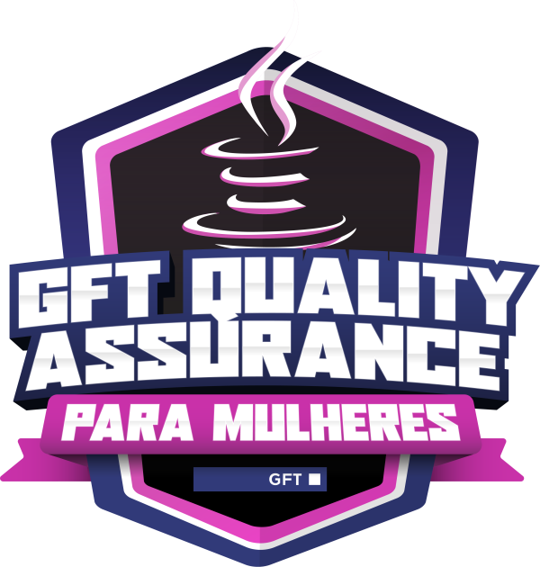
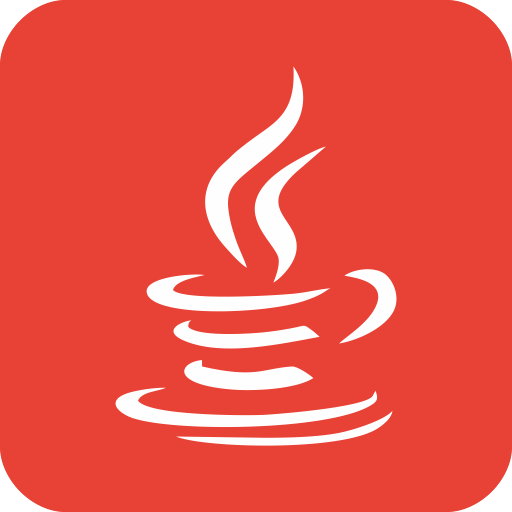

# GFT Quality Assurance Para Mulheres

Em parceria com a *Digital Innovation One*, a GFT está promovendo o Bootcamp **GFT Quality Assurance Para Mulheres**, o programa ideal para pessoas que se identificam como mulheres e que estão buscando a sua primeira oportunidade no mercado de TI, seja por transição de carreira ou até mesmo júniores em busca de crescimento profissional - e inclusive uma maior oportunidade na GFT. Com o objetivo de formar até mesmo quem nunca viu nada sobre o assunto, este bootcamp é uma excelente porta de entrada para quem deseja aprender de verdade e construir uma carreira na área de Quality Assurance.

Para acompanhar o meu progresso, é só acessar o material disponibilizado neste repositório conforme os módulos indicados abaixo.

     

## EMENTA

### MÓDULO 1: PREPARE-SE PARA A JORNADA (ONBOARDING)
<!-- TOC -->
* **CURSO:** Conheça as oportunidades da DIO
* **CURSO:** Boas-vindas ao GFT Quality Assurance Para Mulheres
* **CURSO:** Seja Protagonista Neste Bootcamp
* **CURSO:** Introdução ao Desenvolvimento Moderno de Software
* **MENTORIA:** Aula Inaugural
<!-- TOC -->

### MÓDULO 2: FUNDAMENTO DE QUALIDADE E DESENVOLVIMENTO DE SOFTWARE
<!-- TOC -->
* **CURSO:** Introdução ao Mercado de Qualidade de Software
* **CURSO:** Fundamentos de Qualidade de Software
* **CURSO:** Metodologias Ágeis e Ciclo de Desenvolvimento de Software
* **CURSO:** O Caminho Para a Certificação CTFL
* **DESAFIO DE PROJETO:** O dia a dia de um QA: A prática de testes manuais funcionais [*Swag Labs Shopping*] 
<!-- TOC -->

### MÓDULO 3: PRINCÍPIOS DE PROGRAMAÇÃO E TESTES COM JAVA
<!-- TOC -->
* **CURSO:** Introdução ao Git e ao GitHub
* **DESAFIO DE PROJETO:** Criando seu Primeiro Repositório no GitHub Para Compartilhar Seu Progresso
* **CURSO:** Introdução à Plataforma Java
* **CURSO:** Ambiente de Desenvolvimento Java
* **CURSO:** Aprendendo a Sintaxe Java
* **CURSO:** Lógica Condicional e Controle de Fluxos em Java
* **CURSO:** Estruturas de Repetição e Arrays em Java
* **CURSO:** Entendendo Métodos Java
<!-- TOC -->

### MÓDULO 4: DOMINANDO ALGORITMOS BÁSICOS COM DESAFIOS DE CÓDIGO JAVA
<!-- TOC -->
* **DESAFIO DE CÓDIGO:** Desafio: Média de Idade
* **DESAFIO DE CÓDIGO:** Desafio: Qual é o seu Turno?
* **DESAFIO DE CÓDIGO:** Desafio: A Fila do Banco
* **DESAFIO DE CÓDIGO:** Desafio: Encontrando o Percentual de Desconto
* **DESAFIO DE CÓDIGO:** Descubra o Menor Múltiplo
<!-- TOC -->

### MÓDULO 5: PROGRAMAÇÃO ORIENTADA A OBJETOS COM JAVA
<!-- TOC -->
* **CURSO:** Programação Orientada a Objetos
* **CURSO:** Trabalhando com Collections Java
* **DESAFIO DE PROJETO:** Abstraindo um Bootcamp Usando Orientação a Objetos em Java
* **CURSO:** Debugging Java
* **CURSO:** Tratamentos de Exceções em Java
* **CURSO:** Gerenciamento de Dependências e Build em Java com Maven
* **CURSO:** Testes Unitários com JUnit
* **CURSO:** Desenvolvendo Testes Utilizando Mockito
<!-- TOC -->

### MÓDULO 6: DOMINANDO ALGORITMOS INTERMEDIÁRIOS COM DESAFIOS DE CÓDIGO JAVA
<!-- TOC -->
* **DESAFIO DE CÓDIGO:** Desafio: Flecha, Escudo ou Espada
* **DESAFIO DE CÓDIGO:** Desafio: Número Feliz
* **DESAFIO DE CÓDIGO:** Desafio: Quantidade Necessária
* **DESAFIO DE CÓDIGO:** Desafio: Diferença entre Dígitos
* **DESAFIO DE CÓDIGO:** Desafio: Emboscada no RPG
<!-- TOC -->

### MÓDULO 7: EXPLORANDO OS PRINCIPAIS TIPOS DE TESTE NA PRÁTICA
<!-- TOC -->
* **CURSO:** Principais Protocolos de Comunicação da Internet
* **CURSO:** Introdução à Criação de Websites com HTML5 e CSS3
* **CURSO:** Fundamentos de Automação de Testes
* **CURSO:** Testes de API: Dos Manuais aos Automatizados
*  **CURSO:** Automação de Testes com Selenium WebDriver e Java
* **DESAFIO DE PROJETO:** Explorando o Rest Assured Para a Automação de Testes de API    
<!-- TOC -->